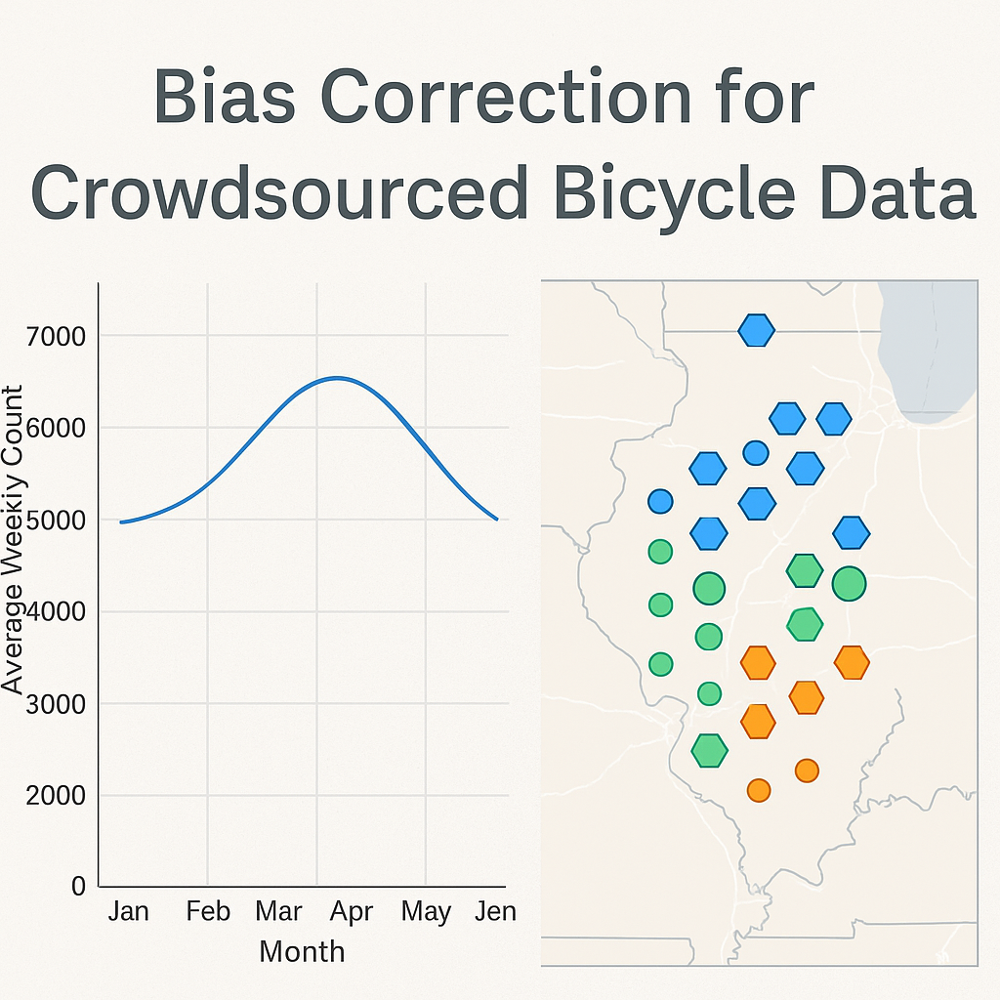

# Bias Correction of Crowdsourced Bicycle Count Data Cookbook



[](https://github.com/ProjectPythia/cookbook-template/actions/workflows/nightly-build.yaml)
[](https://binder.projectpythia.org/v2/gh/ProjectPythia/BiasCorrectionCrowdsourcedData-cookbook/main?labpath=notebooks)
[](https://zenodo.org/badge/latestdoi/475509405)

_See the [Cookbook Contributor's Guide](https://projectpythia.org/cookbook-guide) for step-by-step instructions on how to create your new Cookbook and get it hosted on the [Pythia Cookbook Gallery](https://cookbooks.projectpythia.org)!_

This Project Pythia Cookbook covers **bias correction of crowdsourced bicycle ridership data (Strava) using traditional count sources (EcoCounter)** in Northwest Arkansas, incorporating spatial clustering, multivariate regression, and residual analysis.

## Motivation

This cookbook provides a reproducible workflow to identify, quantify, and correct bias in Strava bicycle count data using EcoCounter ground-truth data. You'll learn how to clean and merge weekly count data, engineer features, model spatial-temporal patterns, and evaluate model performance using regression and clustering methods.

## Authors

[Nelofar Qulizada](https://github.com/nqulizada835)

### Contributors

<a href="https://github.com/ProjectPythia/cookbook-template/graphs/contributors">
  
</a>

## Structure

This cookbook is broken up into two main sections: **"Data Preprocessing and Exploratory Analysis"** and **"Modeling and Bias Correction"**.

### Section 1: Data Preprocessing and Exploratory Analysis

Includes:
- Loading and merging weekly EcoCounter and Strava data
- Creating spatial hexbin aggregations
- Visualizing counts over time and space
- Exploring potential covariates

### Section 2: Modeling and Bias Correction

Includes:
- Building linear regression models to predict EcoCounter counts
- Performing seasonal regression breakdowns
- Visualizing spatial clustering of residuals
- Generating interactive maps and outputs

## Running the Notebooks

You can either run the notebook using [Binder](https://binder.projectpythia.org/) or on your local machine.

### Running on Binder

The simplest way to interact with a Jupyter Notebook is through
[Binder](https://binder.projectpythia.org/), which enables the execution of a
[Jupyter Book](https://jupyterbook.org) in the cloud. The details of how this works are not
important for now. All you need to know is how to launch a Pythia
Cookbooks chapter via Binder. Simply navigate your mouse to
the top right corner of the book chapter you are viewing and click
on the rocket ship icon, and be sure to select
“launch Binder”. After a moment you should be presented with a
notebook that you can interact with.

Note, not all Cookbook chapters are executable. If you do not see
the rocket ship icon, such as on this page, you are not viewing an
executable book chapter.

### Running on Your Own Machine

If you are interested in running this material locally on your computer, follow this workflow:

1. Clone the repository:
   ```bash
   git clone https://github.com/ProjectPythia/BiasCorrectionCrowdsourcedData-cookbook.git
